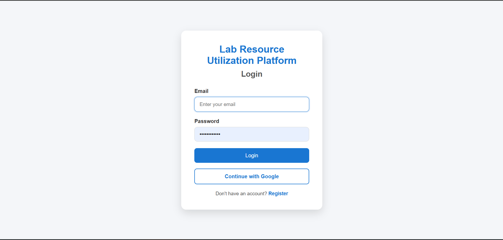
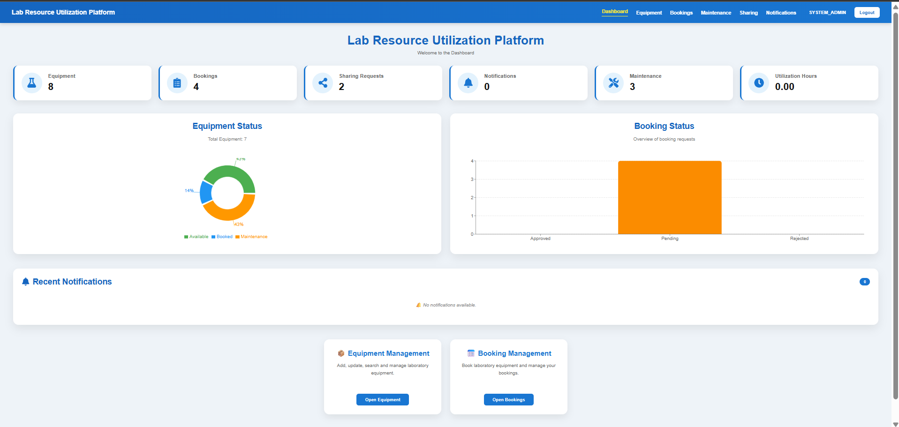
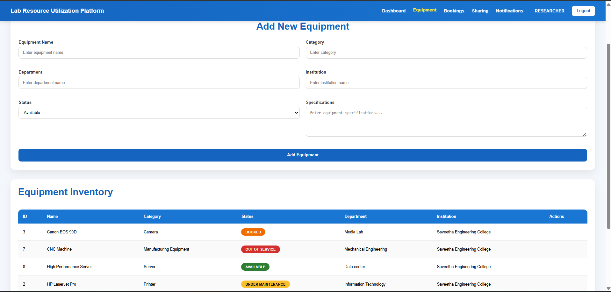
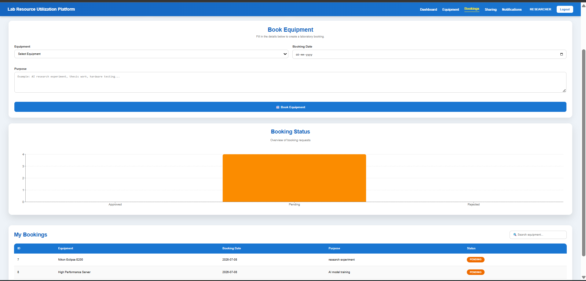
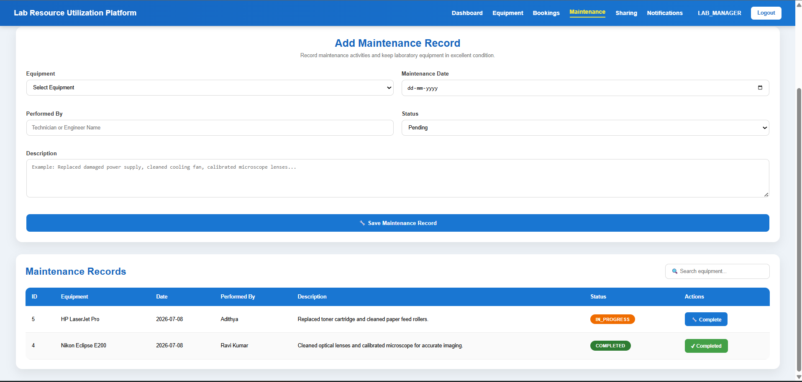
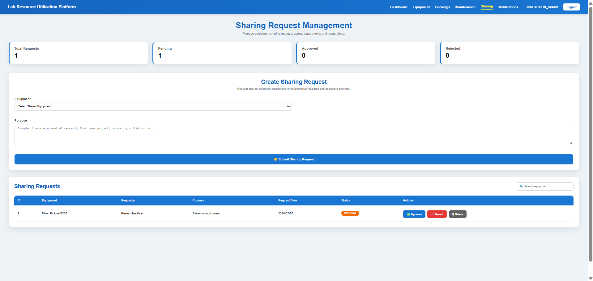
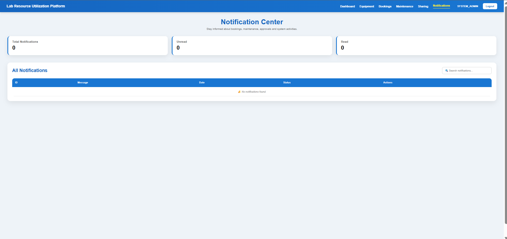

# 🧪 Lab Resource Utilization Platform

A full-stack web application for managing laboratory resources efficiently across institutions.

---

## 📌 Project Overview

The Lab Resource Utilization Platform helps educational institutions manage laboratory equipment, bookings, maintenance schedules, and inter-institution resource sharing through a centralized web application.

---

## 🚀 Features

- 🔐 JWT Authentication
- 🔑 Google OAuth Login
- 👤 Role-Based Access Control
- 🧪 Equipment Management
- 📅 Equipment Booking
- 🔧 Maintenance Management
- 🤝 Equipment Sharing Requests
- 🔔 Notification System
- 📊 Analytics Dashboard
- 🗄 PostgreSQL Database

---

## 🛠 Tech Stack

### Backend
- Java 17
- Spring Boot
- Spring Security
- Spring Data JPA
- JWT Authentication
- OAuth2 (Google)
- Maven

### Frontend
- React
- Vite
- Axios
- React Router

### Database
- PostgreSQL

---

## 📂 Project Structure

```
Lab-Resource-Utilization-Platform
│
├── lab-platform-backend
│
└── lab-platform-frontend
```

---

## ⚙️ Installation

### Backend

```bash
cd lab-platform-backend
mvn spring-boot:run
```

### Frontend

```bash
cd lab-platform-frontend
npm install
npm run dev
```

---

## 📸 Screenshots

### 🔐 Login Page



### 🏠 Dashboard



### 🖥️ Equipment Management



### 📅 Booking Management



### 🔧 Maintenance Management



### 🤝 Sharing Requests



### 🔔 Notifications



---

## 🔮 Future Enhancements

- Email Notifications
- QR Code Based Equipment Tracking
- Advanced Analytics
- Responsive Mobile UI
- Report Generation (PDF & Excel)

---

## 👨‍💻 Author

**Naresh Kumar V**

GitHub:
https://github.com/NARESH-KUMAR-V
